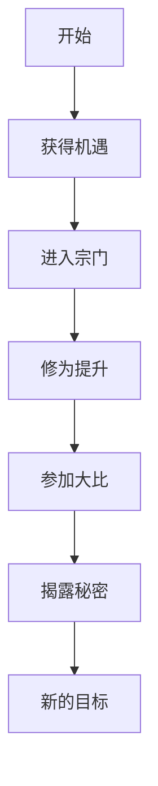

# 故事概览

## 📚 文章结构

### 第一卷：初入仙门
**主题：开启修仙之路**

- 章节数：待定
- 时间跨度：待定
- 主要事件：
  - 第1章：主角的平凡日常
  - 第2章：突然的机遇
  - ...

### 第二卷：宗门大比
**主题：初露锋芒**

- 章节数：待定
- 关键事件：宗门大比、生死历练

### 第三卷及以后
**主题：逐鹿天下**

- 待续...

## 🎯 主线任务

## 🔄 核心冲突

### 内部冲突
- 修为瓶颈
- 心魔困扰
- 身份秘密

### 外部冲突
- 宗门争斗
- 魔道对抗
- 秘密组织

## 💡 伏笔与谜团

!!! question "待揭晓的谜团"
    1. 主角的真实身份是什么？
    2. 那场古老的战争发生了什么？
    3. 灭世遗迹中隐藏着什么？
    4. 为什么魔道最近活跃？
    5. 神秘人物的目的是什么？
